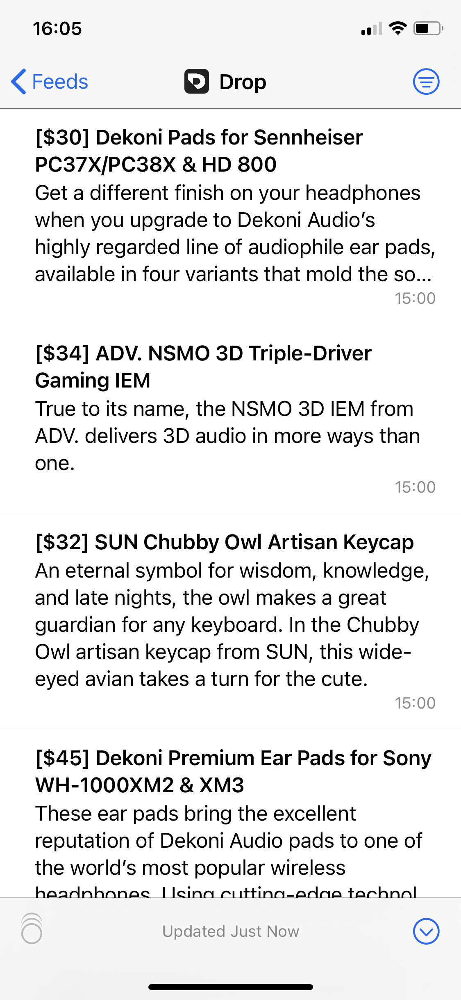

# drop-rss

Hacked-together RSS server for Drop.com products

*Results in the excellent [NetNewsWire](https://github.com/Ranchero-Software/NetNewsWire) app.*

## Motivation

It's very clear that people want RSS for Drop: [Exhibit A](https://drop.com/talk/259/talk/494355), [Exhibit B](https://drop.com/talk/1093/talk/1574182), [Exhibit C](https://drop.com/talk/1093/talk/1574194)

>So it's 4:30 AM and I've kind of reverse engineered the API of Drop.com to export it to RSS

## Quick Start

1. Install the required Python packages (`beautifulsoup4`, `requests`, `feedgen`)
2. Run the server with `python3 main.py`
3. Point your reader to `http://localhost:8080`
4. *Never miss a good deal again.*

## Function

Polls drop.com every 10 minutes for products. Caches the XML and serves it over HTTP.

## Warnings and To-Dos

Don't run the server in a production environment unless you live for the risks.

PRs are open (This would be nice in a docker container)

### Legal

Not sure if this violates any Terms of Service. If anything, it's doing Drop a favor by reducing bandwidth.
